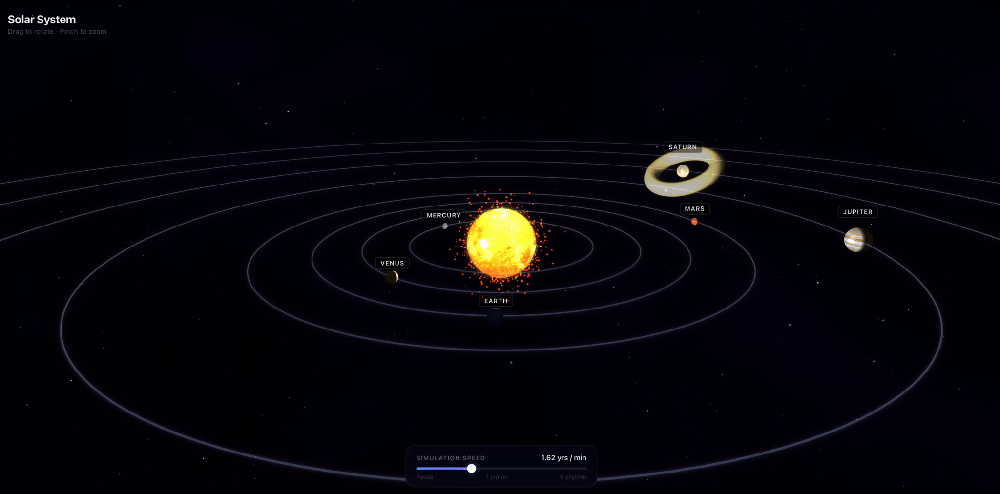

# Solar System Explorer

> 🤖 This project was entirely designed, architected, and coded by [Claude Code](https://claude.ai/code) (Anthropic) through a conversational session — no manual code was written.

An interactive 3D solar system built with [Reactylon](https://reactylon.com) (React + Babylon.js).



## Getting started

```bash
npm install
npm start
```

Open [http://localhost:3000](http://localhost:3000).

## Controls

| Action | Result |
|--------|--------|
| Drag | Rotate view |
| Pinch / scroll | Zoom |
| Tap a planet or its label | Zoom in + info card |
| Speed slider | Control simulation speed (Earth years / min) |

## Textures

Planet textures are from [Solar System Scope](https://www.solarsystemscope.com/textures/) and are licensed under [Creative Commons Attribution 4.0](https://creativecommons.org/licenses/by/4.0/).
